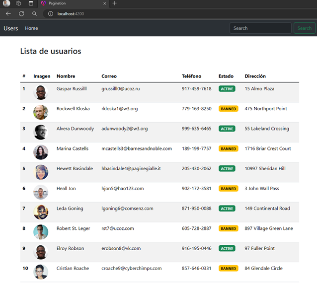

# Angular - Pagination

This project was generated with [Angular CLI](https://github.com/angular/angular-cli) version 17.3.5.

---

## Creando Servicio

Nuestra clase de servicio, define la función que llama al endpoint del backend que nos retorna datos paginados del usuario. Es importante resaltar que para poder hacer uso de la clase `HttpClient` debemos agregar en el archivo `app.config.ts` el provider `provideHttpClient()`:

```typescript
export const appConfig: ApplicationConfig = {
  providers: [
    provideRouter(APP_ROUTES),
    provideHttpClient(),
  ]
};
```

Antes de crear la clase de servicio, es importante definir el tipado de la repuesta que nos retorna el backend. A continuación se muestra las interfaces que tiparan la respuesta:

`api-response.interface.ts`
```typescript
export interface ApiResponse<T> {
  timeStamp:  Date;
  statusCode: number;
  status:     string;
  message:    string;
  data:       T;
}

export interface Page {
  content:          User[];
  pageable:         Pageable;
  last:             boolean;
  totalPages:       number;
  totalElements:    number;
  size:             number;
  number:           number;
  sort:             Sort;
  first:            boolean;
  numberOfElements: number;
  empty:            boolean;
}

export interface User {
  name:     string;
  address:  string;
  status:   Status;
  phone:    string;
  email:    string;
  imageUrl: string;
}

export enum Status {
  active = 'ACTIVE',
  banned = 'BANNED',
  pending = 'PENDING'
}

export interface Pageable {
  pageNumber: number;
  pageSize:   number;
  sort:       Sort;
  offset:     number;
  paged:      boolean;
  unpaged:    boolean;
}

export interface Sort {
  empty:    boolean;
  sorted:   boolean;
  unsorted: boolean;
}
```

Ahora que ya tenemos definida las interfaces que tiparán la respuesta, vamos a construir la clase de servicio:

```typescript
@Injectable({
  providedIn: 'root'
})
export class UserService {

  private readonly _serverUrl = 'http://localhost:8080';
  private readonly _httpClient = inject(HttpClient);

  public getUsers(name: string = '', page: number = 0, size: number = 10): Observable<ApiResponse<Page>> {
    const params = new HttpParams()
      .append('name', name)
      .append('page', page)
      .append('size', size);

    return this._httpClient.get<ApiResponse<Page>>(`${this._serverUrl}/api/v1/users`, { params });
  }

}
```

## Creando pipe 

Crearemos un pipe para poder retornar las clases de badge según el status del usuario

```typescript
@Pipe({
  name: 'userStatus',
  standalone: true
})
export class UserStatusPipe implements PipeTransform {

  transform(status: string): string {
    type UserStatus = { [key: string]: string };
    const userStatus: UserStatus = {
      ACTIVE: 'badge text-bg-success',
      BANNED: 'badge text-bg-warning',
      PENDING: 'badge text-bg-danger'
    };
    return userStatus[status];
  }

}
```

## Creando componente users-pagination - Inicio

Antes de codificar nuestro componente, vamos a definir otro archivo donde definiremos una interfaz que estará vinculado con el procesamiento de los usuarios; simplemente es una interfaz que nos permite tipar los datos:

`util-interface.ts`
```typescript
export interface ProcessingUsers {
  appState: State;
  appData?: ApiResponse<Page>;
  error?: HttpErrorResponse;
}

export enum State {
  APP_LOADED = 'APP_LOADED',
  APP_LOADING = 'APP_LOADING',
  APP_ERROR = 'APP_ERROR',
}
```

Ahora, en el componente de typescript vamos a llamar al servicio `UserService` y hacer uso del método que construimos anterioremente:

```typescript
@Component({
  selector: 'app-users-pagination',
  standalone: true,
  imports: [AsyncPipe, JsonPipe, NgClass, UserStatusPipe],
  templateUrl: './users-pagination.component.html',
  styleUrl: './users-pagination.component.scss'
})
export class UsersPaginationComponent implements OnInit {

  private _userService = inject(UserService);

  public userState$!: Observable<ProcessingUsers>;

  ngOnInit(): void {
    this.userState$ = this._userService.getUsers()
      .pipe(
        map((resp: ApiResponse<Page>) => {
          return { appState: State.APP_LOADED, appData: resp } as ProcessingUsers;
        }),
        startWith({ appState: State.APP_LOADING } as ProcessingUsers),
        catchError((error: HttpErrorResponse) => of({ appState: State.APP_ERROR, error } as ProcessingUsers))
      );
  }
}
```

Notar que el contenido que nos retorna la función `getUsers()` del servicio `UserService` lo estamos transformando con el operador `pipe` de rxjs a un objeto del tipo `ProcessingUsers` para finalmente transformarse en un `Observable<ProcessingUsers>`. El resultado lo estamos almacenando en la variable `userState$`.

Otro punto a resaltar es que estamos haciendo uso del operador `startWith` que es útil para emitir un valor inicial justo al suscribirse al observable antes de que comience a emitir los valores normales.

En el código, el observable `this._userService.getUsers()` emite los usuarios después de una llamada al servicio. Sin embargo, antes de que se complete esa llamada y los usuarios se emitan, emitiremos un estado inicial indicando que la aplicación se está cargando. Esto se hace utilizando el operador `startWith`.

Aquí está cómo se aplica en tu código:

```typescript
startWith({ appState: State.APP_LOADING } as ProcessingUsers)
```

Esto significa que antes de que el observable `this._userService.getUsers()` emita cualquier valor, se emitirá primero `{ appState: State.APP_LOADING } as ProcessingUsers`.

Entonces, cuando te suscribes a `this.userState$`, recibirás este valor inicial `{ appState: State.APP_LOADING }`, y a continuación los datos de usuarios o un estado de error, según lo que ocurra después.

`startWith` se usa para emitir un valor inicial en un observable antes de que comience a emitir sus valores normales, lo que puede ser útil para representar estados iniciales o valores predeterminados.

`startWith`, devuelve un observable que, en el momento de la suscripción, emitirá de forma sincrónica todos los valores proporcionados a este operador, luego se suscribirá a la fuente y reflejará todas sus emisiones a los suscriptores.

Ahora que hemos implementado el componente de typescript vamos a implementar su correspondiente html:

```html
@if (userState$ | async; as state ) {
@switch (state.appState) {
@case ('APP_LOADING') {
<div class="d-flex justify-content-center mt-4">
  <div class="container-spinner text-center">
    <div class="spinner-border text-secondary" role="status">
      <span class="visually-hidden"></span>
    </div>
    <span class="d-block">Loading...</span>
  </div>
</div>
}
@case ('APP_LOADED') {
<div class="container">
  <div class="row">
    <div class="col-md-12 mt-3">
      <h3 class="mt-3 mb-5">Lista de usuarios</h3>
      @if (state.appData!.data.content.length > 0) {
      <table class="table table-striped table-hover">
        <thead>
          <tr>
            <th scope="col">#</th>
            <th scope="col">Imagen</th>
            <th scope="col">Nombre</th>
            <th scope="col">Correo</th>
            <th scope="col">Teléfono</th>
            <th scope="col">Estado</th>
            <th scope="col">Dirección</th>
          </tr>
        </thead>
        <tbody class="table-group-divider">
          @for (user of state.appData!.data.content; track $index) {
          <tr>
            <th scope="row">{{ $index + 1 }}</th>
            <td></td>
            <td>{{ user.name }}</td>
            <td>{{ user.email }}</td>
            <td>{{ user.phone }}</td>
            <td><span [ngClass]="user.status | userStatus">{{ user.status }}</span></td>
            <td>{{ user.address }}</td>
          </tr>
          }
        </tbody>
      </table>
      } @else {
      <div class="alert alert-warning" role="alert">¡No users found!</div>
      }
    </div>
  </div>
</div>
}
@case ('APP_ERROR') {
<div class="alert alert-danger">
  There was an error
</div>
<pre>{{ state.error | json }}</pre>
}
}
}
```
Ojo que aquí estamos haciendo uso de los nuevos flujos de control de `Angular 17 @if @switch @case @for`.

## Verificando ejecución del componente

Hasta este punto estamos mostrando únicamente la lista que nos retorna el backend en nuestro componente de html. Más adelante implementaremos la paginación y búsqueda.


